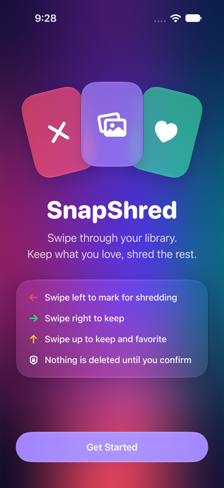
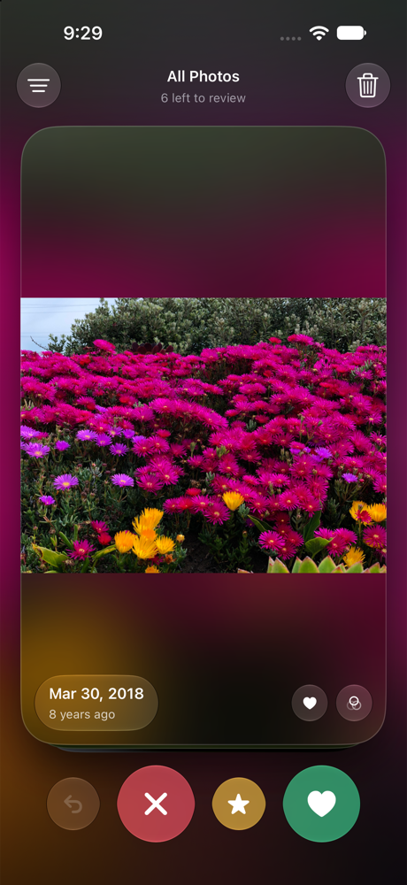

# SnapShred

**Tinder for your camera roll.** SnapShred shows your photos one at a time — swipe right to keep, swipe left to shred. When you're done, review the pile and delete everything in one tap.

Built with SwiftUI and the iOS 27 **Liquid Glass** design language.

<p align="center">
  
  &nbsp;&nbsp;
  
</p>

## Features

- **Swipe to decide** — left to shred, right to keep, up to keep *and* favorite. Cards tilt, fly and spring back with physical, velocity-aware motion.
- **Nothing is deleted until you confirm** — swiped-left photos wait in the **Shred Bin**. Tap any photo to rescue it, or long-press to preview.
- **One-tap cleanup** — delete the whole bin at once, with an estimate of the storage you'll free. Deleted items go to *Recently Deleted* for 30 days.
- **Undo** — brings the last card back from the side it left.
- **Picks up where you left off** — decisions are saved, so reviewed photos never come back.
- **Focused decks** — filter by All Photos, Screenshots, Selfies, Live Photos or Videos, sorted newest or oldest first.
- **Lifetime stats** — total items shredded and space freed.
- **Liquid Glass everywhere** — interactive glass controls that react as you drag, glass metadata pills and verdict stamps, and an ambient backdrop of the current photo that washes red or green with your swipe.
- **Haptics and accessibility** — haptic feedback on every decision, plus VoiceOver actions to keep, shred or favorite.

## Requirements

- iOS 27.0+
- Xcode 27+

## Getting Started

1. Clone the repo and open `SnapShred.xcodeproj`.
2. In **Signing & Capabilities**, choose your own development team.
3. Run on a device or the iOS 27 simulator and grant photo library access.

No third-party dependencies.

## Project Structure

```
SnapShred/
├── SnapShredApp.swift          # App entry, routes between welcome and deck
├── Model/
│   ├── SwipeSession.swift      # Deck, shred bin, undo and stats
│   ├── DecisionStore.swift     # Persists every decision to disk
│   ├── PhotoService.swift      # PhotoKit image loading, deletion, favorites
│   ├── LibraryFilter.swift     # Filters and sort order
│   ├── LibraryAuthorization.swift
│   └── SwipeDecision.swift     # Keep / shred / favorite and theme colors
└── Views/
    ├── WelcomeView.swift       # Onboarding and permission request
    ├── DeckScreen.swift        # Card stack, drag gesture, controls, toolbar
    ├── PhotoCard.swift         # A single card with glass badges and stamps
    ├── ReviewBinView.swift     # Review, restore and delete
    ├── CompletionView.swift    # "All caught up" summary
    └── Components/             # AssetImage, AmbientBackground, GlassActionButton
```

## Privacy

SnapShred works entirely on device. Your photos never leave your phone, and nothing is deleted without iOS's own confirmation prompt.

## Roadmap

- Duplicate and similar-photo detection
- Smart decks: blurry shots, old screenshots, largest files first
- "On This Day" deck
- Video and Live Photo playback on cards
- Pinch-to-zoom preview
- Daily goals, streaks and a Home Screen widget
